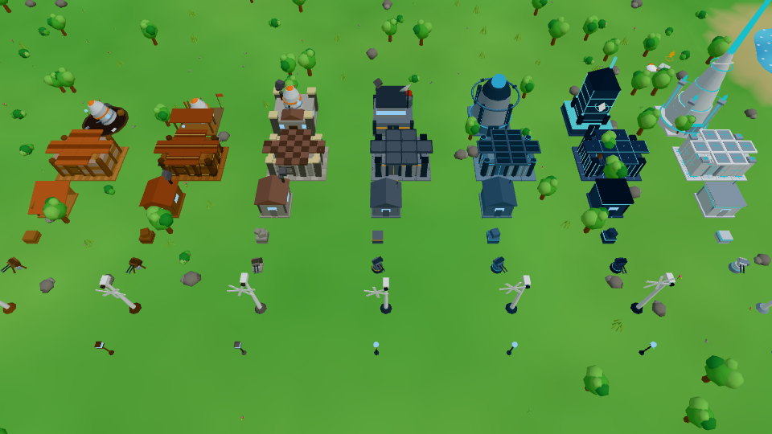
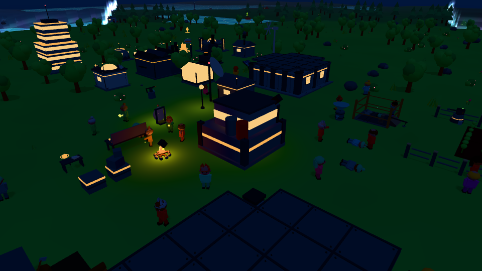
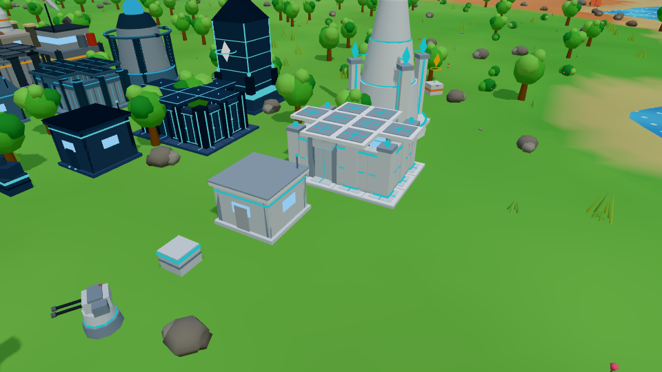

# Nova Colony

A cozy mobile base-building game for **iOS and Android**: crash-land on a beautiful alien planet, gather,
build, recruit survivors, automate everything and fend off alien invasions — growing a wooden camp into a
gleaming **Titanium super-colony**.



| Night colony | Titanium tier |
|---|---|
|  |  |

## Highlights

- **7 base tiers** — Wood → Reinforced Wood → Stone → Steel → Advanced Alloy → Nano-Tech → Titanium — with
  procedural low-poly architecture that visibly transforms (the command center goes from crashed escape pod
  to titanium citadel).
- **Free-form building** on a touch-friendly grid: drag-to-build walls, automatic roofs over enclosed rooms,
  move/rotate/copy for free, full refunds, level and material upgrades, "upgrade entire room", mass upgrades,
  blueprints.
- **150 buildings, 90 research nodes, 72 recipes, 65 items, 6 vehicles**, all data-driven (`src/data`).
- **Colonists** with names, looks, traits, specialties, skills and happiness (bonuses only — nobody leaves),
  who visibly chop, mine, farm, eat, sleep and shelter.
- **Automation path**: you chop → colonists chop → logging camps → harvesters → drones; power grids,
  refineries, factories with automatic crafting, offline production with a generous *Welcome Back*.
- **Alien invasions** with a 2:00 warning, flow-field pathing, 14 alien types (crawlers to Titans and
  bosses), 10 turret families, traps, shields and drones — never punishing: buildings auto-repair for free.
- **Open world**: 8 biomes unlocked over time, fog of war, points of interest, survivor camps, alien nests,
  fast-travel beacons and teleporters, 19 random world events.
- **Live-ops**: 105 missions (a polished first-15-minute tutorial chain), 7-day login rewards, a daily spin
  wheel in your colony, 50-level season pass (free + premium), optional Colony Pass, Nova Crystals,
  in-app purchases and opt-in rewarded ads (always useful, never forced). Nothing gameplay-related is paywalled.
- **Procedural audio**: every sound effect and the adaptive, mood-per-biome ambient music are synthesized
  with WebAudio — no audio files.
- **Mobile-first**: virtual joystick, context button, one-handed management, autosave + rotating backups +
  recovery codes + optional cloud sync, privacy-conscious analytics hooks.

## Tech

TypeScript · Vite · three.js · Capacitor 8 (iOS/Android) · Vitest · AdMob · RevenueCat.
No binary art or audio assets — models are procedural geometry, sounds are synthesized.

```
src/core      Game loop, event bus, save model (GameState), shared view/input state
src/data      Data-driven content: resources, tiers, buildings, research, recipes, items, aliens,
              invasions, biomes, nodes, POIs, vehicles, events, missions, monetization, balance
src/sim       Headless simulation systems (unit-tested): construction, economy, research, crafting,
              progression, colonists, combat, world, player, world events, missions, tutorial, live-ops
src/render    three.js renderer: terrain, nature, buildings per tier, characters, aliens, VFX, day/night
src/ui        Touch UI: HUD, joystick, build mode, panels, shop, tutorial guidance
src/audio     Procedural SFX + generative music
src/platform  Save manager, ads, IAP, analytics, haptics, cloud — web mocks + Capacitor adapters
```

See [`docs/ARCHITECTURE.md`](docs/ARCHITECTURE.md) for contracts and conventions,
[`docs/SPEC.md`](docs/SPEC.md) for the design brief and [`docs/MOBILE.md`](docs/MOBILE.md) for native builds,
store products, AdMob/RevenueCat setup and the release checklist.

## Develop

```bash
cd nova-colony
npm ci
npm run dev          # http://localhost:5173 (desktop: WASD/arrows move, Q/E rotate, Space interact, B build)
npm test             # headless simulation, data-integrity, pacing and playthrough tests
npm run build        # typecheck + production bundle in dist/
npm run cap:android  # build, sync and open Android Studio   (cap:ios for Xcode)
```

Dev pages: `showcase.html` (renderer showcase: `?scene=colony|tiers|battle|aliens&t=0.8`),
`audio-test.html` (sound board). `window.game` is exposed in dev builds for debugging.
