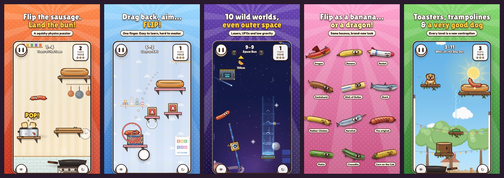

# 🌭 Sizzle Flip

A polished mobile physics game about flipping a squishy sausage out of a frying pan, onto random household objects, and — eventually — into a hot dog bun.

Inspired by the one-button chaos of *a weird game about sausage*, rebuilt for phones with touch controls and **200 machine-verified levels** across 10 worlds.



| | |
|---|---|
| **Platforms** | iOS & Android (installable PWA, works offline) · Capacitor native shell for the App Store / Play Store · any desktop browser |
| **Controls** | Drag back anywhere, aim with the trajectory guide, release to flip. Land on things, flip again. |
| **Content** | 10 worlds × 20 levels, 600 stars, 12 unlockable sausage skins, 17 trophies, route hints, per-level par & best scores |
| **Tech** | Vanilla JS + Canvas 2D, custom deterministic soft-body physics, procedural vector art, synthesized audio — zero image/audio assets |

## The worlds

1. **The Kitchen** – toasters that pop you sky-high, slippery butter, knife blocks, boiling pots, timed burners
2. **Living Room** – bouncy couches, a sleeping cat, rotating clock hands, sticky beanbags, the fireplace
3. **Backyard BBQ** – trampolines, swings, leaf blowers, sprinkler geysers, flaring grills, and a very good dog
4. **Splish Splash** – soap, rubber ducks, shower downdrafts, hair dryers, the toilet (don't)
5. **The Office** – rolling chairs, desk fans, shredders, conveyor belts, hover-bots
6. **Toy Box** – drums, jack-in-the-boxes, toy trains, balloon baskets, giant pinwheels
7. **Supermarket** – checkout belts, rolling carts, icy freezers, the deli slicer, lobster tanks
8. **Sandy Shores** – the ocean below, crabs, seagulls, beach balls, bobbing buoys
9. **Frank in Space** – low gravity, lasers, gravity lifts, spinning satellites, UFOs
10. **Hot Dog Heaven** – clouds, giant condiments, donuts, deep fryers, forks… and the final flip

## Play it

```bash
npm install
npm run dev        # http://localhost:8123  (no build step needed while developing)
npm run build      # → dist/  single-file index.html + PWA manifest + service worker + icons
```

Deploy `dist/` to any static host (Netlify, GitHub Pages, Vercel…). On a phone, open the URL and **Add to Home Screen** — it runs full-screen and offline.

Dev URL flags: `?level=37` jump to a level · `?debug` collision overlay + all worlds unlocked · `?nosw` skip the service worker.

## Testing

```bash
npm run dev &               # serve on :8123, then:
npm test                    # e2e-ads, e2e-native, e2e-shop, e2e-recover, e2e-all (plays all 200 levels)
node tools/qa.mjs           # every route replayed with human-sized error
npm run release:check       # pre-publish gate (see RELEASE.md)
```

`tools/e2e-all.mjs` plays every level through the real game: each stored route is fed through the game's own touch handlers at the exact physics step the solver used, then NEXT, the world-complete cards and forced ads are handled through the real UI. `tools/e2e-native.mjs` mocks the Capacitor plugins (AdMob event semantics, Android back button) to test the app-only code paths.

## Native app store builds (Capacitor)

The repo contains a configured Android project (`android/`): Capacitor 8, **targets Android 16 (API 36)** as Google Play requires, portrait (Android 16 ignores the lock on tablets, and the game also plays in landscape there), adaptive icon and splash generated from the game's own art, and an optional release signing config. iOS is one command on a Mac. **Step-by-step publishing guide: [RELEASE.md](RELEASE.md).**

```bash
npm run cap:sync                        # build the web game and copy it into the native projects
npm run release:check                   # pre-publish gate
cd android && ./gradlew bundleRelease   # signed AAB (with android/keystore.properties), or use Android Studio
npx cap add ios && npx cap open ios     # on macOS with Xcode → Archive → App Store Connect
```

Native extras are wired in automatically when running inside Capacitor: real haptics (`@capacitor/haptics`), a hidden status bar (`@capacitor/status-bar`), the Android back button (`@capacitor/app`) and AdMob.

## Ads

Ad logic lives in `src/ads.js` (pacing rules `AD_RULES`, the AdMob and placeholder providers). The AdMob ids live in `src/ads-config.js`; while they are Google's test ids the app runs in test mode.

**When ads appear**

| Ad | Where | Rule |
|---|---|---|
| Forced (interstitial) | Tapping **Next** or **Levels** on the level-complete card | Not before 5 levels are beaten **and** 5 minutes are played · then at most every 3rd level beaten **and** 3+ minutes apart · skipped after a level that took 10+ fails · never on world-complete, the finale, retry, fail or pause |
| Reward (opt-in) | 💡 hint | The first hint in each world is free; later ones show an **AD** badge and unlock after a reward ad |
| Reward (opt-in) | ⏭ skip | Shows after 8 fails on an unbeaten level (never on level 200). The level is marked *skipped* (no stars) and the next one opens |
| Reward (opt-in) | 🎯 Long aim guide (Pause menu and Options) | One ad turns it on for 10 minutes of real time (`longAimMinutes`). The aim line then shows 1.3 s of flight instead of 0.55 s. A countdown shows in the HUD, the timer survives reloads, and the player is told when it ends. A tip points to it after 5 fails |

If no ad is available (no fill, offline), the reward is granted anyway. A taken hint stays on screen through restarts. The game pauses and its audio is muted while any ad is showing. There are no banners. Setting `save.adsRemoved` (wire it to a "Remove ads" purchase) stops forced ads and keeps the opt-in ones.

**Testing the flow:** the Claude artifact, a `localhost` dev server and any URL with `?adtest` show clearly labelled placeholder ads. **Settings → Ad testing** (test builds only) has fast pacing, a "Remove ads" switch, buttons to preview both ad types, and a live readout of the pacing state. `node tools/e2e-ads.mjs` runs the whole flow in headless Chromium (42 checks). `node tools/e2e-recover.mjs` checks that the game can't get stuck (camera parked, input dead) after the view shrinks to zero size or the frame clock jumps. A deployed web build shows no ads.

**Going live with AdMob** (`@capacitor-community/admob` is installed and synced):

1. Create the app and two ad units (Interstitial, Rewarded) per platform in the [AdMob console](https://apps.admob.com).
2. Put the unit ids in `ADMOB_UNITS` in `src/ads-config.js` (test mode switches off by itself once no Google test id is left). To keep test ads on your own phone, add its test-device id to `testingDevices`.
3. Android: replace `admob_app_id` in `android/app/src/main/res/values/strings.xml` (it's read by `AndroidManifest.xml`).
4. iOS (after `npx cap add ios`): add to `ios/App/App/Info.plist` the keys `GADApplicationIdentifier` (your iOS app id), `GADIsAdManagerApp` = `true`, `SKAdNetworkItems` (Google's list) and `NSUserTrackingUsageDescription` (for example "Used to show you more relevant ads.").
5. Set up a GDPR consent message (AdMob → Privacy & messaging). The app asks for consent and App Tracking Transparency at launch.
6. Store forms: declare that the app contains ads and fill in the data-safety section (advertising ID). If you target children, set `childDirected: true` and follow Google Play Families policy.
7. `npm run cap:sync`, then `npm run release:check`, then build (see [RELEASE.md](RELEASE.md)).

Google's public test ids are configured now, so a debug build shows real test ads right away. Players in the EEA/UK can reopen the consent form from **Options → Privacy choices**.

## Shop

130 cosmetic characters, from a stick of butter to a dragon, sit in seven shop tabs: Food, Sweets, Stuff, Rides, Critters, Party and Colors, plus an Owned tab. Each costs $1 as a one-time in-app purchase (`src/shop.js`), and the **Everything Bundle** ($9.99) unlocks all of them, including future ones. The characters are defined in `src/art/items.js` (the first 30) and `src/art/items-more.js` (100 more), and drawn by `src/art/itemkit.js` over the sausage's own soft-body particle chain: a width profile along the same centreline, painted details, attachments (stems, sticks, wheels, fins, wings) and the same expressive face. The physics, and so every level, are unchanged. In the app, purchases go through Google Play Billing or StoreKit (`@capgo/native-purchases`), are acknowledged automatically, and are restored from the store at launch and with **Restore**. Test builds use a clearly labelled test store. The plain web build shows the items as "In the app". `tools/items-gallery.html` shows every item in three poses.

## How the levels are made (and why they're all beatable)

Levels are built by `tools/generate.mjs` from per-world *recipes* (which props, hazards and mechanics are unlocked at each level, with the tutorial tip that introduces them) and a difficulty curve (target par, level height, obstacle density).

Every candidate level is then **played by a bot**: `tools/solver.mjs` beam-searches thousands of flips per resting position using the *exact same deterministic physics* the game runs and finds the fewest-flip route. Each shot on that route is re-fired with human-sized mistakes (aim ±1.2°, power ±2%, reaction time ±0.06 s) and must still work a set fraction of the time — high for early levels, lower as the game gets harder — so no level depends on a pixel-perfect shot. Impossible, trivial or fragile levels are rejected and rebuilt. The winning route is stored with the level and **replayed continuously** to prove it reproduces; that same route powers the in-game 💡 hint and the title-screen demo.

`node tools/qa.mjs` re-plays every stored route with random human error and reports a success rate per level. `node tools/tune-par.mjs` then sets each level's **par**: the bot's fewest flips, plus one (or two, for long routes) where the clean route is rarely executed perfectly, so three stars stay within reach. The solver's minimum is kept as `minFlips` — beating par is possible and earns the *Under Par* trophy.

Full rebuild: `node tools/generate.mjs --workers 4 && node tools/tune-par.mjs` (about 1–2 hours on 4 cores).

```bash
node tools/generate.mjs --workers 4             # (re)generate all 200 levels → src/levels/data.js
node tools/generate.mjs --only 41 --force       # regenerate a single level
```

QA pages (serve the folder, then open):

- `tools/levelview.html?src=game&ids=0,1,2` — whole levels with the solver's route traced
- `tools/gallery.html?world=kitchen&debug=1` — every prop of a world with its collision outline
- `tools/faces.html` — the sausage's expression sheet

## Project layout

```
index.html, styles.css      app shell + menus (DOM) and the game canvas
src/main.js                 boot, loop, input routing, progression, save data
src/game.js                 one level session: sim, aiming, camera, effects, rendering
src/physics.js              deterministic position-based soft-body physics (shared with the solver)
src/objects.js              prop library: collision shapes, materials, roles (10 worlds, 100+ props)
src/art/                    procedural vector art: sausage + face, props per world, backgrounds, logo
src/audio.js                synthesized SFX + per-world procedural music
src/ads.js                  ad pacing rules, AdMob + placeholder providers
src/ads-config.js           AdMob ids (edit before release)
src/shop.js                 shop: store billing / test store, ownership, equip
src/art/itemkit.js          shop character renderer (art only — same physics body as the sausage)
src/art/items.js            shop characters 1–30, tabs; items-more.js: 100 more
src/privacy.js              privacy policy (in-app + dist/privacy.html)
src/levels/data.js          the 200 generated & verified levels
tools/                      generator, solver, par tuning, QA (e2e, perturbation), build, icon & screenshot renderers
store/                      listing.md (store text), ios/ (1290×2796) and play/ (1080×1920) screenshots; icons/ has store icons + feature graphic
android/                    Capacitor Android project
```

## Credits

Everything — code, art, sound and music — is generated from code in this repo. Fonts: [Lilita One](https://fonts.google.com/specimen/Lilita+One) and [Fredoka](https://fonts.google.com/specimen/Fredoka), SIL Open Font License (see `assets/fonts/`).
