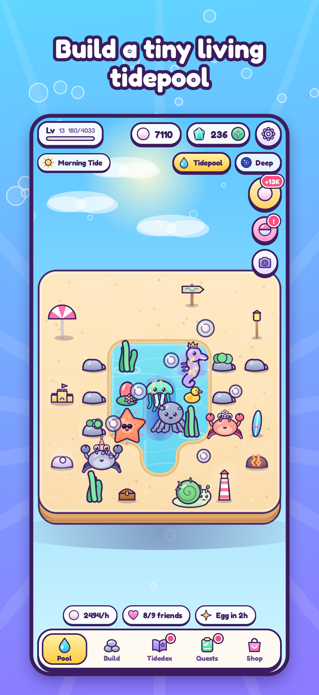
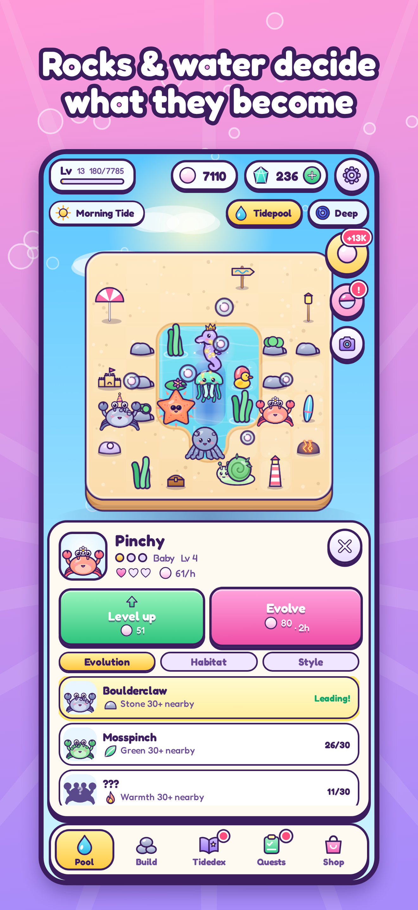
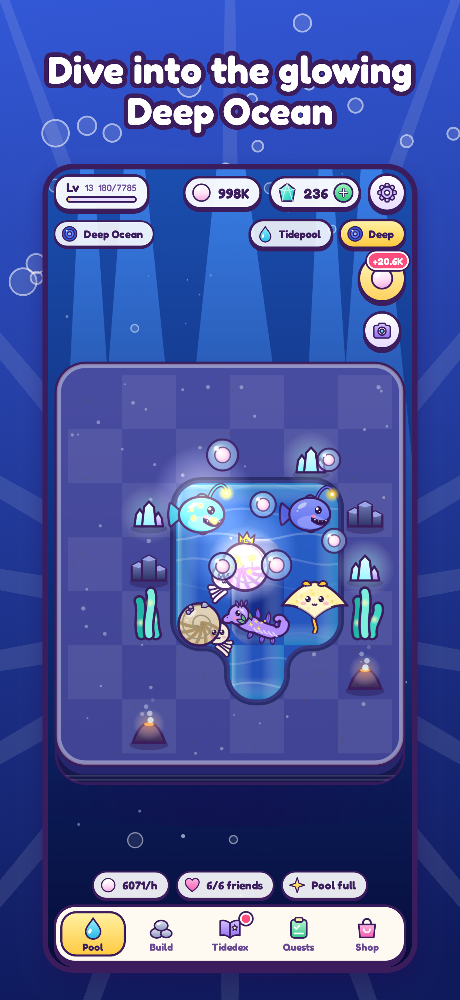

# 🌊 Tiny Tides

*An idle tidepool ecosystem you check on a few times a day. Creatures evolve based on how you arrange rocks and water.*

Vanilla JavaScript + Canvas 2D game (with a gashapon-style **Capsule Machine**) (≈250 KB, no engine), wrapped for iOS with **Capacitor 8** (Swift Package Manager) and **StoreKit 2** purchases. All art is procedural and all audio is synthesized — there are no image/sound assets to license.

<p align="center">  </p>

## Quick start
```bash
npm ci                   # also applies patches/ (StoreKit delivery fix) via postinstall
npm run verify           # everything below in one go: lint, unit tests, legal check, site check, e2e, release build
npm test                 # 100 rules, economy, text and legal tests, incl. fuzzers (random play, corrupted saves)
npm run lint             # ESLint (src, tests, tools) — must be clean
npm run build:demo       # web build in www/ (simulated purchases) — serve www/ with any static server
npm run build:single     # one self-contained playable file: dist/tiny-tides-demo.html
npm run dev              # debug build with watch (window.__tt cheat hooks enabled)
npm run test:e2e         # phone-viewport Playwright: full run-through, Capsule Machine, review regressions (debug build)
node tools/qa/monkey.mjs # random-tap UI monkey test; tools/qa/perf.mjs = CPU-throttled frame cost
npm run balance          # economy, collector-progression and capsule-economy simulations
npm run trailer          # renders the 30 s App Store / social trailer into store/trailer/ (needs ffmpeg with libx264)
```
Ship it: **[docs/APP_STORE_RELEASE.md](docs/APP_STORE_RELEASE.md)** · no Mac? **[docs/BUILD_WITHOUT_A_MAC.md](docs/BUILD_WITHOUT_A_MAC.md)** (GitHub builds and uploads to TestFlight) · the non-code paperwork: **[legal/APP_STORE_ADMIN_CHECKLIST.md](legal/APP_STORE_ADMIN_CHECKLIST.md)** · listing copy: [store/APP_STORE_LISTING.md](store/APP_STORE_LISTING.md) · design & balance: [docs/GAME_DESIGN.md](docs/GAME_DESIGN.md) · what was verified: [docs/QA_REPORT.md](docs/QA_REPORT.md)

## Before you can submit (5 minutes of your details)
Fill in **`legal/site.config.json`** (your legal or LLC name, US state and web address; the support email `maceion@proton.me` and country are already set, and no address or phone is published), then `npm run site`, host the `site/` folder at that address, and `npm run legal:check` must pass. `npm run release` refuses to continue until it does. See [legal/README.md](legal/README.md).

## Layout
```
src/data.js          all content & tuning: traits, pieces, 10 families/70 forms, decor, products, quests, capsule odds
src/sim.js           pure game rules (no DOM / no Date.now): traits, spawn, evolve, offline catch-up, IAP ledger, capsules, save validation
src/render.js        Canvas scene: blobby water, day/night sky, creatures, particles
src/art_creatures.js procedural kawaii creature drawing + hats;  src/art_world.js rocks, props, eggs
src/gacha_ui.js      Capsule Machine UI: animated machine, reveals, Toybox, Prize Counter, drop-rate disclosure
src/art_gacha.js     machine + capsule physics, figurines (incl. gold plating), item pictures
src/ui.js            DOM UI (HUD, inspector, Tidedex, shop, quests, settings, age check & parental gate, legal & credits, tutorial coach)
src/i18n.js          all text goes through t(); src/locales/en.json is generated by `npm run i18n` (the game ships in English)
src/regions.js       countries where paid pulls (Belgium, Brazil) or set rewards (Japan) are switched off
src/game.js          controller: save queue/load, actions, purchase delivery & reconcile, tutorial, reminders
src/platform.js      Capacitor bridge (storage, haptics, notifications, share, StoreKit) with web fallbacks
src/audio.js         WebAudio synth: SFX + procedural ocean loop
ios/                 Xcode project (SPM) — icon, splash, privacy manifest, StoreKit test file, AgeRangePlugin.swift (Apple Declared Age Range)
patches/             patch-package fix for the StoreKit plugin (never finish a purchase before it is saved)
legal/               site.config.json + templates + checklists → generates site/ and store/APP_REVIEW_NOTES.md
site/                GENERATED public pages (privacy, terms, drop rates, parents, support, licenses) — host these
store/               listing copy (listing/en.json), IAP table, review notes, screenshots, trailer/ (30 s video)
tools/               build, site & legal generators, asset/screenshot tools;  tools/qa/ = e2e, monkey, perf, balance simulations;  tools/trailer/ = trailer renderer
test/                node:test suites (rules, capsules, economy, hardening, fuzz, legal, text & listing limits)
```

## Handy scripts
| | |
|---|---|
| `npm run site` / `site:check` | regenerate / verify the website and store documents from `legal/` + `src/data.js` |
| `npm run legal:check` | release gate: no placeholders, pages current, ids consistent |
| `npm run assets` | re-render icon/splash from game art and refresh the Xcode asset catalog |
| `npm run store-shots` | regenerate App Store screenshots (iPhone 6.9″/6.5″, iPad 13″) |
| `npm run storekit` | regenerate `TinyTides.storekit` + `store/iap-products.md` from `src/data.js` |
| `npm run rename -- com.you.tinytides` | change the bundle id (and all IAP ids, Xcode, Capacitor, legal config) everywhere |
| `npm run sheet` | contact sheet of all 70 creatures |
| `npm run ios:sync` / `ios:open` | build + `cap sync` / open Xcode |

## Adding a creature
Add a `br` entry to a family in `src/data.js` (name, mythic name, palette, deco list). Deco vocabulary lives in `art_creatures.js` (`moss, rocks, lava, leaves, glowdots, bubbles, stars, crystals, stripes, spots, rays, aura`). `npm test` checks unique names and that every needed trait is producible in that biome; `npm run sheet` shows it.
